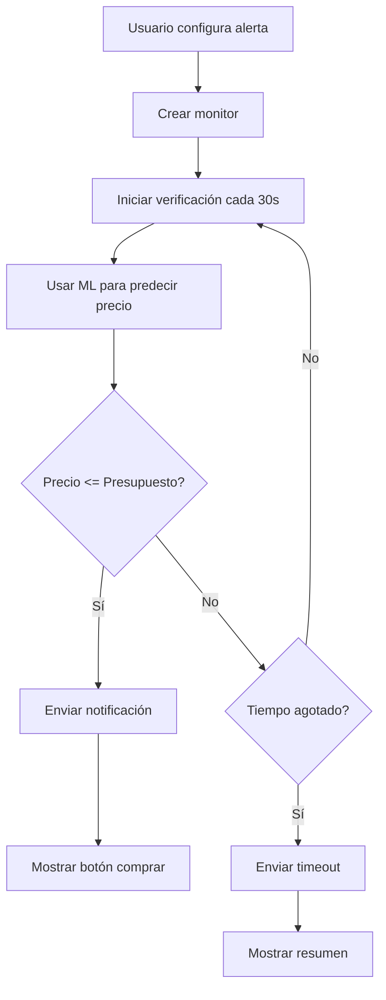

# 🚨 Sistema de Alertas de Precios - WadaTrip

## 📋 Descripción

El sistema de alertas de precios de WadaTrip permite a los usuarios configurar un **presupuesto máximo** y un **tiempo límite** para encontrar vuelos. Utiliza el **algoritmo de Alfred (ML)** para monitorear constantemente los precios y notificar cuando se encuentra una oferta dentro del presupuesto.

## ✨ Características Principales

### 🎯 Monitoreo Inteligente
- **Algoritmo ML**: Utiliza RandomForest para predicción de precios
- **Búsqueda Continua**: Verifica precios cada 30 segundos
- **Presupuesto Dinámico**: Alerta cuando el precio está dentro del rango
- **Tiempo Límite**: Configuración flexible de tiempo máximo de espera

### 📧 Sistema de Notificaciones
- **Email Automático**: Notificaciones por correo electrónico
- **Alertas en Tiempo Real**: Notificaciones instantáneas en la UI
- **Resumen de Timeout**: Información cuando se agota el tiempo

### 🔧 Configuración Flexible
- **Múltiples Destinos**: Monitoreo simultáneo de varias rutas
- **Perfiles de Viajero**: Configuraciones predefinidas
- **Callbacks Personalizados**: Acciones automáticas al encontrar precios

## 🚀 Cómo Usar

### 1. Acceso a la Funcionalidad

```javascript
// Navegar a la página de alertas
http://localhost:5174/price-alerts
```

### 2. Configurar una Alerta Básica

```javascript
import { createFlightPriceAlert } from './services/flightPriceMonitor.js';

const alertData = {
  origin: 'Madrid',
  destination: 'Tokio',
  departureDate: '2024-06-15',
  returnDate: '2024-06-25',
  passengers: '2',
  cabinClass: 'economy',
  budget: 500,        // Presupuesto máximo en USD
  maxWaitTime: 48,    // Máximo 48 horas de espera
  userEmail: 'tu@email.com'
};

const monitorId = createFlightPriceAlert(alertData);
```

### 3. Ejemplo de Uso Completo

```javascript
// Crear alerta con callbacks personalizados
const alertData = {
  origin: 'Barcelona',
  destination: 'Nueva York',
  departureDate: '2024-07-10',
  passengers: '1',
  cabinClass: 'business',
  budget: 1200,
  maxWaitTime: 72, // 3 días
  userEmail: 'viajero@ejemplo.com',
  
  // Acción cuando se encuentra el precio
  onPriceFound: (offer) => {
    console.log('🎉 ¡Precio encontrado!', offer);
    
    // Auto-reserva si el precio es excelente
    if (offer.price <= 1000) {
      console.log('💰 Precio excelente, considerando auto-reserva...');
    }
  },
  
  // Acción cuando se agota el tiempo
  onTimeout: (summary) => {
    console.log('⏰ Tiempo agotado', summary);
    if (summary.bestPriceFound) {
      console.log(`Mejor precio encontrado: $${summary.bestPriceFound.price}`);
    }
  }
};

const monitorId = createFlightPriceAlert(alertData);
```

## 🏗️ Arquitectura del Sistema

### Componentes Principales

1. **FlightPriceMonitor** (`src/services/flightPriceMonitor.js`)
   - Gestión de monitores activos
   - Lógica de verificación de precios
   - Manejo de timeouts y notificaciones

2. **MLFlightPredictor** (`src/services/mlFlightPredictor.js`)
   - Algoritmo de Machine Learning (RandomForest)
   - Predicción de precios basada en datos históricos
   - Factores: origen, destino, fecha, clase, demanda

3. **NotificationService** (`src/services/notificationService.js`)
   - Envío de emails
   - Templates de notificaciones
   - Futuras integraciones (SMS, Push)

4. **FlightPriceAlert** (`src/components/FlightPriceAlert.jsx`)
   - Interfaz de usuario
   - Formulario de configuración
   - Visualización de alertas activas

### Flujo de Trabajo



## 📊 Perfiles de Viajero

El sistema incluye perfiles predefinidos para diferentes tipos de viajeros:

### 💰 Viajero Económico
- **Presupuesto**: Hasta $300
- **Tiempo de espera**: 1 semana
- **Clase**: Economy
- **Flexibilidad**: Alta

### 💼 Viajero de Negocios
- **Presupuesto**: Hasta $1,500
- **Tiempo de espera**: 24 horas
- **Clase**: Business
- **Flexibilidad**: Baja

### 🌟 Viajero de Lujo
- **Presupuesto**: Hasta $5,000
- **Tiempo de espera**: 3 días
- **Clase**: First
- **Flexibilidad**: Media

### 👨‍👩‍👧‍👦 Familia
- **Presupuesto**: Hasta $2,000
- **Tiempo de espera**: 5 días
- **Clase**: Economy
- **Flexibilidad**: Alta

## 🔧 Configuración Avanzada

### Variables de Entorno

```env
# Configuración de notificaciones
SMTP_HOST=smtp.gmail.com
SMTP_PORT=587
SMTP_USER=tu@email.com
SMTP_PASS=tu_password

# Configuración de ML
ML_MODEL_UPDATE_INTERVAL=3600000  # 1 hora
PRICE_CHECK_INTERVAL=30000        # 30 segundos

# Configuración de alertas
MAX_ACTIVE_MONITORS=100
DEFAULT_MAX_WAIT_TIME=168         # 1 semana en horas
```

### Personalización de Algoritmo ML

```javascript
// Ajustar factores de predicción
const mlConfig = {
  seasonalityWeight: 0.3,
  demandWeight: 0.25,
  distanceWeight: 0.2,
  cabinClassWeight: 0.15,
  advanceBookingWeight: 0.1
};
```

## 📱 Interfaz de Usuario

### Formulario de Configuración
- **Origen y Destino**: Selección de ciudades
- **Fechas**: Ida y vuelta (opcional)
- **Pasajeros**: Número de viajeros
- **Clase**: Economy, Business, First
- **Presupuesto**: Cantidad máxima en USD
- **Tiempo Límite**: Horas máximas de espera
- **Email**: Para notificaciones

### Panel de Alertas Activas
- **Estado**: Activa, Completada, Expirada
- **Progreso**: Tiempo restante y verificaciones
- **Mejor Precio**: Precio más bajo encontrado
- **Acciones**: Cancelar, Editar, Ver detalles

### Notificaciones
- **Precio Encontrado**: Alerta verde con botón "Comprar Ya"
- **Tiempo Agotado**: Alerta naranja con resumen
- **Error**: Alerta roja con información del problema

## 🔮 Futuras Mejoras

### Integraciones Planificadas
- **SMS**: Notificaciones por mensaje de texto
- **Push Notifications**: Alertas en tiempo real
- **WhatsApp**: Integración con WhatsApp Business
- **Telegram Bot**: Bot para gestionar alertas

### Funcionalidades Avanzadas
- **Auto-Reserva**: Compra automática cuando se encuentra el precio
- **Alertas Grupales**: Monitoreo para grupos de viajeros
- **Análisis Predictivo**: Recomendaciones de cuándo comprar
- **Comparación Multi-Aerolínea**: Integración con múltiples APIs

### Optimizaciones de ML
- **Deep Learning**: Redes neuronales para mejor predicción
- **Datos en Tiempo Real**: Integración con APIs de aerolíneas
- **Análisis de Sentimiento**: Factores externos (eventos, clima)
- **Optimización de Rutas**: Sugerencias de escalas

## 🛠️ Desarrollo y Testing

### Ejecutar en Desarrollo

```bash
# Instalar dependencias
npm install

# Ejecutar servidor de desarrollo
npm run dev

# Acceder a alertas de precios
http://localhost:5174/price-alerts
```

### Testing

```bash
# Ejecutar tests unitarios
npm test

# Test específico de alertas
npm test -- --grep "price alerts"

# Test de integración ML
npm test -- --grep "ml predictor"
```

### Ejemplos de Uso

```javascript
// Importar ejemplos
import examples from './src/examples/priceAlertExample.js';

// Ejecutar demostración completa
examples.demonstrateFullWorkflow();

// Crear alerta por perfil
const familyAlert = examples.createAlertByProfile('family', {
  origin: 'Madrid',
  destination: 'Orlando',
  departureDate: '2024-07-15',
  returnDate: '2024-07-25',
  passengers: '4',
  userEmail: 'familia@ejemplo.com'
});
```

## 📞 Soporte

Para soporte técnico o preguntas sobre el sistema de alertas:

- **Email**: soporte@wadatrip.com
- **Documentación**: [docs.wadatrip.com](https://docs.wadatrip.com)
- **GitHub Issues**: [github.com/wadatrip/issues](https://github.com/wadatrip/issues)

---

**¡Disfruta viajando con WadaTrip! ✈️🌍**